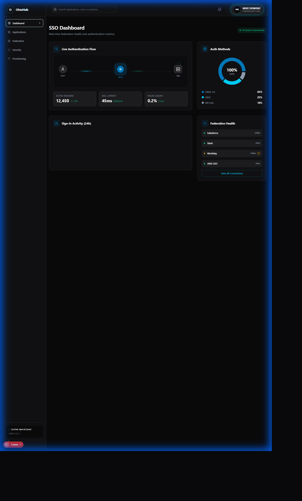
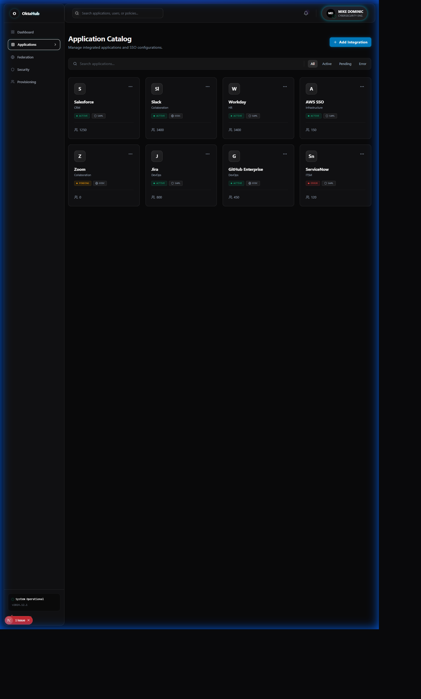
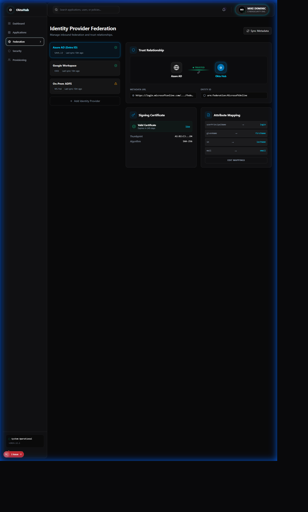
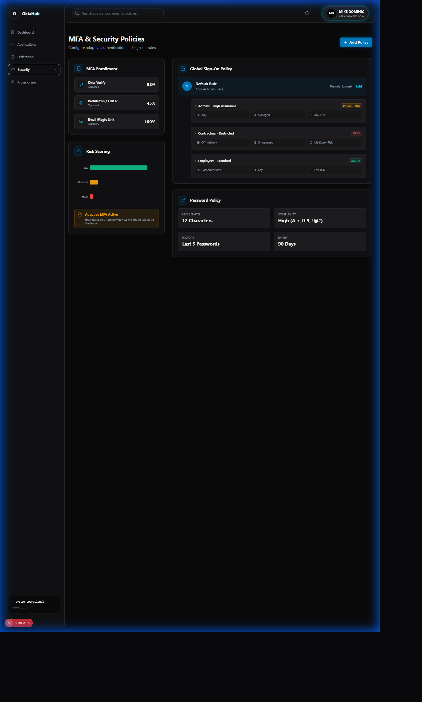
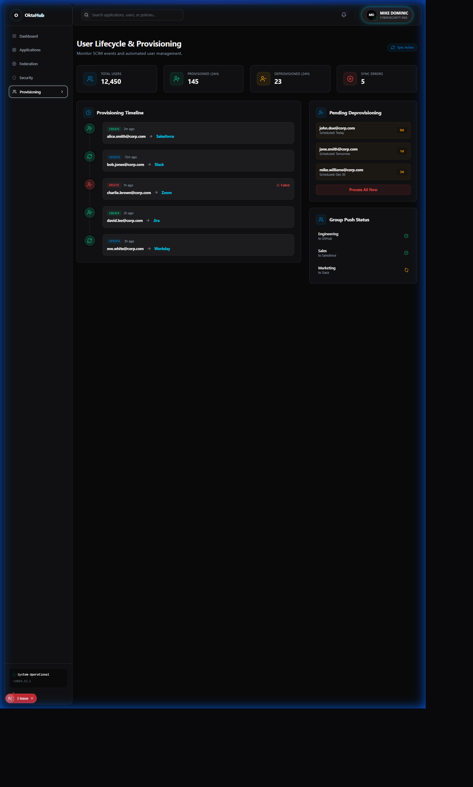

<p align="center">
  
</p>

<h1 align="center">Okta SSO Hub</h1>
<h3 align="center">Enterprise SSO Platform with Workflows Automation</h3>

<p align="center">
  
  
  
  
  
</p>

<p align="center">
  <strong>Complete SSO implementation with SAML 2.0, OIDC/OAuth 2.0, SCIM provisioning, and Okta Workflows automation</strong>
</p>

---

## The Problem

<table>
<tr>
<td width="50%">

### SSO Implementation is Complex

Enterprise SSO challenges:
- **Multiple protocols** (SAML vs OIDC) with different use cases
- **Provisioning delays** from days to weeks
- **Manual workflows** for access requests
- **Protocol confusion** - when to use what?

Organizations struggle with:
- Inconsistent authentication experiences
- Slow user onboarding
- No automated lifecycle management
- Lack of hands-on protocol expertise

</td>
<td width="50%">

### What SSO Teams Need

Modern identity federation requires:
- **Multi-protocol support** (SAML 2.0 + OIDC)
- **Automated provisioning** (SCIM)
- **Workflow automation** for lifecycle events
- **Clear documentation** on protocol choices
- **Working code examples** for each pattern
- **Hands-on certification prep**

**This hub demonstrates all of it.**

</td>
</tr>
</table>

---

## The Solution: Okta SSO Hub

<p align="center">
  
</p>

Complete SSO implementation demonstrating enterprise patterns:

| Capability | Technology | Outcome |
|------------|------------|---------|
| **SSO - SAML** | SAML 2.0 + Flask SP | Enterprise app integration |
| **SSO - OIDC** | OAuth 2.0 + React SPA | Modern app authentication |
| **Provisioning** | SCIM 2.0 | Automated user management |
| **Automation** | Okta Workflows | Event-driven identity lifecycle |
| **API Security** | OAuth 2.0 Tokens | Backend API protection |
| **MFA** | Okta Verify | Strong authentication |

---

## Screenshots

### Dashboard Views

<table>
<tr>
<td align="center" width="33%">

<br/><strong>SSO Dashboard</strong>
<br/>Okta Flow aesthetic
</td>
<td align="center" width="33%">

<br/><strong>Application Catalog</strong>
<br/>SAML + OIDC apps
</td>
<td align="center" width="33%">

<br/><strong>Federation Overview</strong>
<br/>Protocol comparison
</td>
</tr>
</table>

### Additional Views

<table>
<tr>
<td align="center" width="50%">

<br/><strong>Security Policies</strong>
<br/>MFA and access rules
</td>
<td align="center" width="50%">

<br/><strong>User Provisioning</strong>
<br/>SCIM automation
</td>
</tr>
</table>

---

## Why Okta Workflows? (v1.1)

<table>
<tr>
<td width="60%">

### The Integration Rationale

Okta Workflows was chosen for v1.1 because:

1. **Native Platform** - Built into Okta ecosystem
2. **No-Code/Low-Code** - Accessible automation
3. **Event-Driven** - Respond to identity events
4. **Pre-Built Connectors** - 100+ integrations
5. **Enterprise Adoption** - Standard for Okta customers

### Skills Demonstrated

- Okta Workflows API integration
- Flow execution orchestration
- Event-driven triggers
- Async Python programming
- Identity lifecycle automation

</td>
<td width="40%">

### Before vs After

| Metric | v1.0 | v1.1 |
|--------|------|------|
| Automation | Manual | **Workflows** |
| Triggers | None | **Event-driven** |
| Provisioning | Days | **Minutes** |
| Lifecycle | Manual | **Automated** |

### Workflow Triggers Supported

- User created/activated
- Group membership change
- Application assignment
- Password reset
- MFA enrollment
- Sign-on event

</td>
</tr>
</table>

---

## SAML vs OIDC

<table>
<tr>
<td width="50%">

### SAML 2.0

**Best for**:
- Legacy enterprise applications
- B2B federation
- Complex attribute mapping
- Established corporate apps

**Characteristics**:
- XML-based assertions
- Browser-based flows
- Mature enterprise standard
- SP-initiated or IdP-initiated

**In this project**: Flask SAML SP

</td>
<td width="50%">

### OIDC / OAuth 2.0

**Best for**:
- Modern SPAs and mobile apps
- API authentication
- Microservices
- Consumer applications

**Characteristics**:
- JSON-based tokens (JWT)
- Mobile-friendly flows
- Built on OAuth 2.0
- Authorization + Authentication

**In this project**: React OIDC SPA

</td>
</tr>
</table>

### Protocol Decision Flow

```
                    ┌────────────────────────┐
                    │  New Application SSO   │
                    └───────────┬────────────┘
                                │
                    ┌───────────▼────────────┐
                    │  What type of app?     │
                    └───────────┬────────────┘
                                │
           ┌────────────────────┼────────────────────┐
           │                    │                    │
    ┌──────▼──────┐      ┌──────▼──────┐      ┌──────▼──────┐
    │   Legacy    │      │  Modern SPA │      │  Mobile     │
    │   Enterprise│      │  or React   │      │   App       │
    └──────┬──────┘      └──────┬──────┘      └──────┬──────┘
           │                    │                    │
    ┌──────▼──────┐      ┌──────▼──────┐      ┌──────▼──────┐
    │  SAML 2.0   │      │ OIDC + PKCE │      │ OIDC + PKCE │
    └─────────────┘      └─────────────┘      └─────────────┘
```

---

## Architecture

```
                                OKTA TENANT
    ┌─────────────────────────────────────────────────────────────────┐
    │                                                                  │
    │  ┌────────────┐  ┌────────────┐  ┌────────────┐  ┌───────────┐ │
    │  │ Universal  │  │   Sign-On  │  │    MFA     │  │ Workflows │ │
    │  │ Directory  │  │  Policies  │  │  Policies  │  │  Engine   │ │
    │  └────────────┘  └────────────┘  └────────────┘  └───────────┘ │
    │                                                                  │
    └─────────────────────────────┬───────────────────────────────────┘
                                  │
            ┌─────────────────────┼─────────────────────┐
            │                     │                     │
            ▼                     ▼                     ▼
    ┌──────────────┐      ┌──────────────┐      ┌──────────────┐
    │  SAML 2.0    │      │    OIDC      │      │  SCIM 2.0    │
    │  Protocol    │      │   Protocol   │      │  Provisioning│
    │              │      │              │      │              │
    │ XML Assertion│      │ JWT Tokens   │      │ User Sync    │
    │ SP-Initiated │      │ PKCE Flow    │      │ Group Sync   │
    └──────┬───────┘      └──────┬───────┘      └──────┬───────┘
           │                     │                     │
           ▼                     ▼                     ▼
    ┌──────────────┐      ┌──────────────┐      ┌──────────────┐
    │ Flask SAML   │      │  React SPA   │      │   Node.js    │
    │ Service      │      │  (OIDC)      │      │   SCIM API   │
    │ Provider     │      │              │      │              │
    │              │      │              │      │              │
    │ Port: 5000   │      │ Port: 3000   │      │ Port: 8080   │
    └──────────────┘      └──────────────┘      └──────────────┘
```

---

## Applications

### 1. React OIDC SPA

Modern single-page application with PKCE flow.

```javascript
// OIDC Configuration
const oktaConfig = {
  issuer: 'https://your-org.okta.com/oauth2/default',
  clientId: 'your-client-id',
  redirectUri: 'http://localhost:3000/callback',
  scopes: ['openid', 'profile', 'email'],
  pkce: true
};
```

**Features**:
- PKCE authorization code flow
- Token refresh handling
- Protected routes
- User profile display

### 2. Flask SAML SP

Enterprise service provider implementation.

```python
# SAML Configuration
SAML_SETTINGS = {
    'sp': {
        'entityId': 'http://localhost:5000/saml/metadata',
        'assertionConsumerService': {
            'url': 'http://localhost:5000/saml/acs'
        }
    },
    'idp': {
        'entityId': 'https://your-org.okta.com',
        'singleSignOnService': {
            'url': 'https://your-org.okta.com/app/saml/sso'
        }
    }
}
```

**Features**:
- SP-initiated SSO
- Attribute mapping
- Session management
- Metadata endpoint

### 3. Node.js Protected API

OAuth 2.0 protected backend API.

```javascript
// JWT Verification Middleware
const oktaJwtVerifier = new OktaJwtVerifier({
  issuer: 'https://your-org.okta.com/oauth2/default',
  clientId: 'your-client-id'
});

app.use('/api', async (req, res, next) => {
  const token = req.headers.authorization?.split(' ')[1];
  const jwt = await oktaJwtVerifier.verifyAccessToken(token, 'api://default');
  req.user = jwt.claims;
  next();
});
```

---

## Quick Start

### Prerequisites
- Node.js 18+
- Python 3.9+
- Okta Developer Account (free)

### Installation

```bash
# Clone repository
git clone https://github.com/MikeDominic92/okta-sso-hub.git
cd okta-sso-hub

# React OIDC SPA
cd apps/react-oidc-spa
npm install
cp .env.example .env

# Flask SAML SP
cd ../flask-saml-sp
pip install -r requirements.txt
cp .env.example .env

# Node.js API
cd ../node-api
npm install
cp .env.example .env
```

### Configure Okta

1. Create Okta Developer Account
2. Create OIDC Application (SPA)
3. Create SAML Application
4. Configure SCIM provisioning
5. Update `.env` files with credentials

### Run Applications

```bash
# Terminal 1: React SPA
cd apps/react-oidc-spa && npm start

# Terminal 2: Flask SAML
cd apps/flask-saml-sp && python app.py

# Terminal 3: Node API
cd apps/node-api && npm start

# Terminal 4: Frontend Dashboard
cd frontend && npm run dev
```

### Access Points
- **React SPA**: http://localhost:3000
- **Flask SAML**: http://localhost:5000
- **Node API**: http://localhost:8080
- **Dashboard**: http://localhost:3001

---

## v1.1 Workflows Integration Example

```python
from src.integrations import OktaWorkflowsConnector, FlowExecutor, EventTrigger

# Initialize connector
workflows = OktaWorkflowsConnector(
    org_url="https://your-org.okta.com",
    api_token="your-api-token",
    mock_mode=True  # For demo
)

# List available flows
flows = workflows.list_flows()
for flow in flows:
    print(f"{flow['name']}: {flow['id']}")

# Execute a flow
executor = FlowExecutor(workflows)
result = await executor.execute_flow(
    flow_id="flo_abc123",
    inputs={
        "userId": "00u123456",
        "action": "provision_access"
    }
)

# Set up event trigger
trigger = EventTrigger(workflows)
trigger.on_user_created(callback=provision_new_user)
trigger.on_group_membership_changed(callback=update_access)
```

---

## Use Cases

<table>
<tr>
<td width="50%">

### 1. New Employee Onboarding

**Scenario**: New hire starts Monday.

**Automation**:
1. User created in Okta directory
2. Workflows trigger fires
3. SCIM provisions to apps
4. Group assignments applied
5. Welcome email sent

**Outcome**: Day 1 productivity.

</td>
<td width="50%">

### 2. Legacy App SSO

**Scenario**: 10-year-old Java app needs SSO.

**Integration**:
1. Configure SAML 2.0 app in Okta
2. Deploy Flask SAML SP as proxy
3. Map attributes from Okta
4. Test SP-initiated flow

**Outcome**: Legacy app with modern auth.

</td>
</tr>
<tr>
<td width="50%">

### 3. Modern SPA Authentication

**Scenario**: React app needs secure auth.

**Integration**:
1. Create OIDC SPA in Okta
2. Implement PKCE flow
3. Handle token refresh
4. Protect API with JWT

**Outcome**: Secure modern app.

</td>
<td width="50%">

### 4. Automated Access Request

**Scenario**: Manager approves access request.

**Workflow**:
1. Request submitted via portal
2. Workflows routes to manager
3. Approval triggers provisioning
4. User notified automatically

**Outcome**: Minutes not days.

</td>
</tr>
</table>

---

## Project Structure

```
okta-sso-hub/
├── apps/
│   ├── react-oidc-spa/          # OIDC SPA implementation
│   │   ├── src/
│   │   │   ├── components/
│   │   │   ├── pages/
│   │   │   └── okta/
│   │   └── package.json
│   ├── flask-saml-sp/           # SAML SP implementation
│   │   ├── app.py
│   │   ├── saml_config.py
│   │   └── requirements.txt
│   └── node-api/                # Protected API
│       ├── server.js
│       └── middleware/
├── src/
│   └── integrations/            # v1.1: Workflows
│       ├── okta_workflows_connector.py
│       ├── flow_executor.py
│       └── event_trigger.py
├── automation/                  # Python automation scripts
│   └── python/
├── scim/                        # SCIM provisioning
├── policies/                    # Sign-on policies
├── frontend/                    # React dashboard
└── docs/                        # Documentation
```

---

## Skills Demonstrated

| Category | Technologies |
|----------|-------------|
| **Identity Federation** | SAML 2.0, OIDC, OAuth 2.0 |
| **SSO Implementation** | Okta SDK, PKCE, JWT |
| **Automation** | Okta Workflows, SCIM 2.0 |
| **Backend** | Python, Node.js, Flask |
| **Frontend** | React, TypeScript |
| **Security** | MFA, Token Validation |

---

## Certification Prep

This project helps prepare for:

- **Okta Certified Professional**
- **Okta Certified Administrator**
- **Okta Certified Developer**

Key topics covered:
- Universal Directory
- Application integration (SAML/OIDC)
- Sign-on policies
- MFA configuration
- Lifecycle management
- Workflows automation

---

## Roadmap

- [x] **v1.0**: SAML, OIDC, SCIM implementations
- [x] **v1.1**: Okta Workflows integration
- [ ] **v1.2**: Advanced MFA policies
- [ ] **v1.3**: B2B federation (IdP discovery)
- [ ] **v2.0**: Okta Identity Governance

---

## Author

**Mike Dominic**
- GitHub: [@MikeDominic92](https://github.com/MikeDominic92)
- Focus: Enterprise IAM, Okta Platform, Identity Lifecycle Automation

---

## Chainguard IT Engineer (Identity/IAM) Alignment

This project demonstrates key competencies for senior IAM engineering roles:

| Requirement | Evidence |
|-------------|----------|
| Enterprise Okta platform design | Complete SSO implementation with SAML 2.0, OIDC, SCIM |
| Identity lifecycle automation | JML workflows in `automation/workflows/` |
| HRIS integrations | Mock HRIS server in `hris-mock/` |
| Quarterly access reviews | Access certification in `access-certification/` |
| SOC 2/ISO 27001 compliance | Compliance framework mapping in workflows |

---

<p align="center">
  <strong>Enterprise Okta SSO Platform with Identity Lifecycle Automation</strong>
  <br/>
  <sub>Demonstrates Okta Workflows, HRIS Integration, Access Certification, and JML Automation</sub>
</p>
