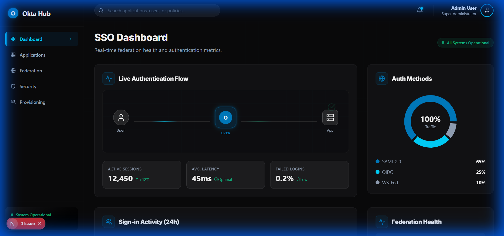
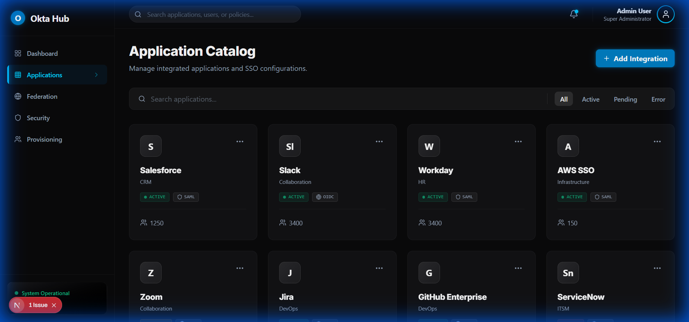
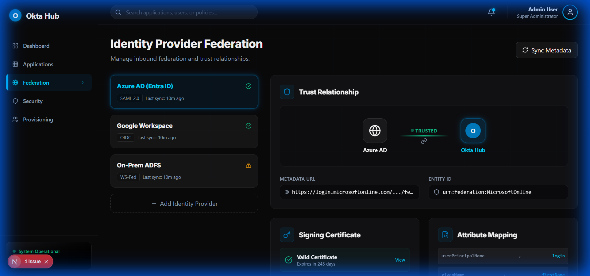
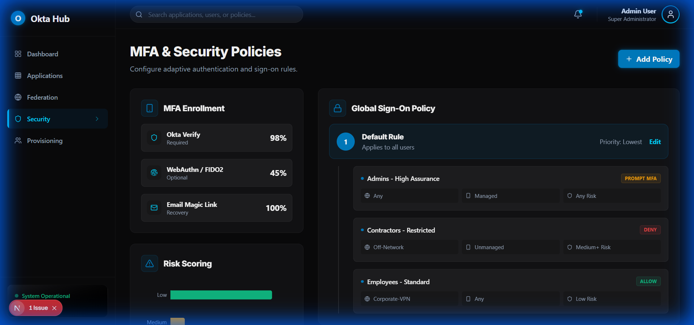
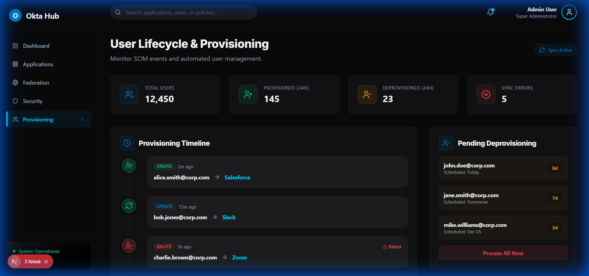

# Okta-SSO-Hub - Frontend Walkthrough

An enterprise SSO integration and federation management dashboard featuring the Okta Flow aesthetic with Obsidian Black backgrounds, Okta Blue accents, and Electric Cyan highlights.

## Technology Stack

- **Framework**: Next.js 16 with App Router
- **Styling**: Tailwind CSS v4 with custom Okta Flow theme
- **Animations**: Framer Motion for flow diagrams and transitions
- **Charts**: Recharts for activity and risk visualization
- **Icons**: Lucide React
- **Fonts**: Inter (headlines/body) + Fira Code (SAML/tokens)

## Design System

### Color Palette
| Color | Hex | Usage |
|-------|-----|-------|
| Obsidian Black | #09090B | Primary background |
| Dark Surface | #18181B | Elevated panels |
| Okta Blue | #007DC1 | Primary accent, Okta brand |
| Electric Cyan | #00D4FF | Secondary accent, active states |
| Slate Gray | #94A3B8 | Secondary text |
| Ghost White | #FAFAFA | Primary text |
| Success Green | #10B981 | Connected/verified |
| Warning Amber | #F59E0B | Pending states |
| Error Red | #EF4444 | Failed/disconnected |

### Visual Effects
- SSO flow animation showing token exchange between IdP and apps
- Pulsing connections between identity provider and applications
- Glassmorphism panels with cyan glow borders
- Smooth transitions on navigation
- Status indicator color transitions

## Screens

### 1. SSO Dashboard
Central hub for federation health and authentication metrics.
- **Flow Visualization**: Animated diagram showing SSO token exchange
- **Real-time Stats**: Active sessions, latency, and failure rates
- **Auth Breakdown**: Pie chart of authentication methods (SAML, OIDC, WS-Fed)
- **Recent Activity**: Timeline of authentication events



### 2. Application Catalog
Grid of integrated applications and their configurations.
- **App Grid**: Status badges and protocol indicators for each app
- **Quick-Add Wizard**: Modal for adding new integrations
- **Filtering**: Filter apps by status (Active, Pending, Error)
- **Protocol Indicators**: SAML 2.0, OIDC, WS-Fed badges



### 3. Identity Provider Federation
Management of inbound federation and trust relationships.
- **Trust Visualizer**: Graphic representation of IdP-to-Hub trust
- **Metadata Config**: Configuration for Entity IDs and endpoints
- **Cert Status**: Monitoring of signing certificates
- **Attribute Mapping**: SAML attribute mapping editor



### 4. MFA & Security Policies
Configuration for adaptive authentication and sign-on rules.
- **Policy Builder**: Conditional access rules based on network, device, and risk
- **Risk Scoring**: Visualization of login risk levels
- **Factor Enrollment**: Status of MFA adoption across users
- **Authenticator Strength**: Visual indicators of factor strength



### 5. User Lifecycle & Provisioning
Monitoring of SCIM events and automated user management.
- **Provisioning Timeline**: Stream of create, update, and delete events
- **Stats Dashboard**: Overview of provisioning activities
- **Deprovisioning Tracker**: Pending offboarding actions
- **Group Push**: Group membership synchronization status



## Custom Components

### Okta Flow UI Components
- **SSOCard**: Glass panels with Okta blue accent borders
- **AppBadge**: Application status with protocol icon
- **FlowDiagram**: Animated SSO flow visualization
- **PolicyRule**: Conditional access rule builder cards
- **ProvisioningEvent**: Lifecycle event timeline entries

## Running the Frontend

```bash
cd frontend
npm install
npm run dev
```

Visit http://localhost:3000

## Build

```bash
npm run build
```

## Key Technical Features

- **Tailwind v4**: CSS-first configuration with custom Okta glow utilities
- **Framer Motion**: Animations for SSO flow and state transitions
- **Real-time Updates**: Smooth fade animations for live authentication data
- **Responsive Design**: Adapts to all screen sizes
- **Protocol Badges**: Visual indicators for SAML, OIDC, and WS-Fed

## Next Steps

- Integrate with Okta System Log API for real-time events
- Add WebSocket support for live authentication streaming
- Implement SAML metadata import/export functionality
- Add policy simulation testing interface
